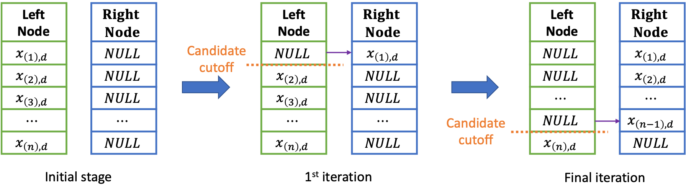
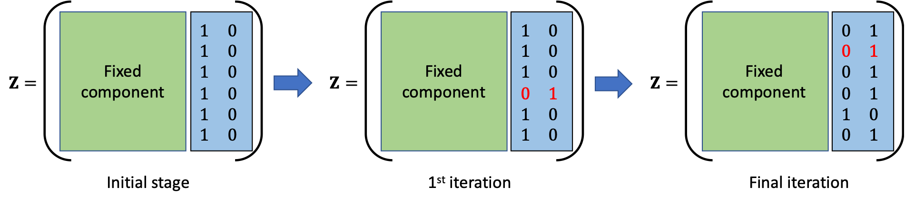
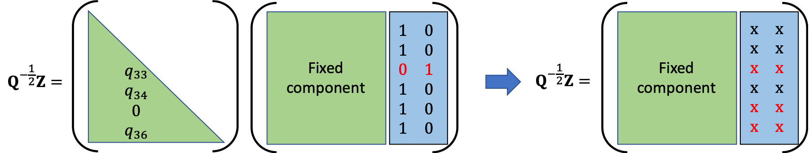

# RandomForestsGLS
====

## Overview
The R package `RandomForestsGLS: Random Forests for dependent data` fits non-linear regression models on dependent data with Generalized Least Square (GLS) based Random Forest (RF-GLS). Classical Random forests ignore the correlation structure in the data for purpose of greedy partition, mean estimation and resampling for each regression tree. The package implements a RF-GLS proposed in Saha, Basu and Datta (2021) which circumvents the aforementioned problems by incorporating a working correlation structure of the data in for partition, mean estimation and resampling. In this article, it is shown that the greedy split criterion of classical regression trees can be written as an Ordinary Least Square (OLS) optimization with membership in current leaf nodes forming the design matrix. The article extends RF to RF-GLS in a similar fashion to how OLS is extended to GLS by incorporating the covariance structure of the data in the cost function. This ensures that the node splitting and node representatives involve contribution from points belonging to other nodes, weighed by their respective spatial correlations. In classical Random Forest (RF), data points are resampled/subsampled for each of the regression trees, without accounting for their inherent correlation structure. RF-GLS circumvents this problem by resampling/subsampling uncorrelated contrasts instead of original data points. `RandomForestsGLS` implements a fast version of RF-GLS which approximates the working correlation structure using nearest neighbors which makes it suitable for larger datasets.

## Installation
In order to install the development version of the package, please run the following command in R:

```{r }
if (!require("devtools")) install.packages("devtools")
devtools::install_github("ArkajyotiSaha/RandomForestsGLS", ref ="HEAD")
```
For installation of the CRAN version of the package, please use the following command in R:

```{r}
install.packages("RandomForestsGLS")
```

## Example usage: Vignette
The package vignette, available at https://cran.rstudio.com/web/packages/RandomForestsGLS/vignettes/RandomForestsGLS_user_guide.pdf demonstrates with example how the functions available in `RandomForestsGLS` can be used for non-linear regression analysis of dependent data. Specific functions are discussed in much detail in the code documentation of the package. 

## Function documentation

For detailed help on the functions in `RandomForestsGLS` please use the following:
```{r }
?RFGLS_estimate_spatial #(for estimation in spatial data)
?RFGLS_estimate_timeseries #(for estimation in timeseries data)
?RFGLS_predict #(for prediction of mean function)
?RFGLS_predict_spatial #(for prediction of Spatial Response)
```
The function input and outputs are described in detail in the reference manual documentation, available in https://cran.rstudio.com/web/packages/RandomForestsGLS/RandomForestsGLS.pdf .

# Package Features
* **Implementation**: The source code of the package are written in [C](https://en.cppreference.com/w/c/language)/[C++](https://isocpp.org/) for sake of optimizing execution time. The functions available to the user are wrappers around the source code, built with `R`'s foreign language interface. For the basic structure of the code, we make use of the open-source code of the regression trees in `R` based implementation of classical RF in `randomForest` package. As the split criterion in RF-GLS involves computationally intensive linear algebra operation in nested loops, we use `Fortran`'s Basic Linear Algebra Subprograms ([BLAS](http://www.netlib.org/blas/)) and Linear Algebra Package ([LAPACK](http://www.netlib.org/lapack/)). This is achieved by storing all matrices in contiguous memory column-major format. We also offer multicore computation by building each regression tree independently.

* **NNGP approximation**: Node splitting in RF-GLS requires optimizing a cost function involving the Cholesky factor of the precision matrix. Use of the full dense precision matrix in spatial processes becomes taxing on typical personal computing resources both in terms of computational cost ($O(n^3)$) and storage cost ($O(n^2)$). In order to circumvent this problem, we use NNGP to replace the dense graph among spatial locations with a nearest neighbor graphical model. NNGP components can be combined to obtain a sparse cholesky factor, which closely approximates the decorrelation performance of the true cholesky. We implement a convenient nearest neighbor search following [spNNGP](https://CRAN.R-project.org/package=spNNGP) [@spnngppaper] and efficient sparse matrix multiplication as in [BRISC](https://CRAN.R-project.org/package=BRISC) [@brisc]. The structure of the loops used in the process facilitates parallelization using `openMP` [@dagum1998openmp] for this stage of calculation. In time series analysis, the sparsity in the precision matrix is inherently induced by AR covariance structure. 

* **Scalable node splitting**: Another aspect of optimization of the proposed algorithm involves clever implementation of the cost function optimization. Provided candidate cut direction ($d$), the optimal cutoff point ($c$) is chosen by searching through the "gaps" in the corresponding covariate. Following the implementation of classical Regression Forest in [randomForest](https://CRAN.R-project.org/package=randomForest), we start with a list of ordered covariate values corresponding to the prefixed candidate direction and assign them to one of the nodes initially. This helps with searching through the "gaps" in the data, as searching the next "gap" is equivalent to switch of membership of the existing smallest member (w.r.t the covariate value in the prefixed direction) of the initially assigned node. In order to determine the cost function corresponding to each of the potential cutoff points, in each iteration, we serially switch the membership of the data points from the initial node. The process is graphically demonstrated in \autoref{fig:example}.



Since a serial update only affects one row in two columns of $\mathbf Z$ (corresponding to the newly formed nodes, an example of changes in $\mathbf Z$ corresponding to the changes in \autoref{fig:example} is demonstrated in \autoref{fig:example2}, here we note that the matrix components are unordered, hence the serial update will not follow the index ordering), the resulting correlation adjusted effective design matrix ($\mathbf Q ^{1/2} \mathbf Z$) only experiences changes in the corresponding two columns and the rows corresonding to the points, which have this specific point in their nearest neighbor set. We efficiently implement this in the package which provides efficiency over brute force recomputation of the effective design matrix for each serial update. The process is graphically demonstrated in \autoref{fig:example3}.





## Community guidelines

Please report issues, bugs or problem with the software at https://github.com/ArkajyotiSaha/RandomForestsGLS/issues . For contribution to the software and support please get in touch with the maintainer Arkajyoti Saha (arkajyotisaha93@gmail.com).

## Note
Some code blocks are borrowed from the R packages: `spNNGP: Spatial Regression Models for Large Datasets using Nearest Neighbor Gaussian Processes` https://CRAN.R-project.org/package=spNNGP and `randomForest: Breiman and Cutler's Random Forests for Classification and Regression` https://CRAN.R-project.org/package=randomForest .
RF-GLS uses nearest neighbor Gaussian process (NNGP) to approximate the covariance structure in the data, tools necessary to implement the NNGP are borrowed from the spNNGP package, which include `util.cpp` and parts of `updateBF_org` and `RFGLS_BFcpp` in `RFGLS.cpp`. The basic building blocks for Random Forest is borrowed from `randomForest` which include parts of `RFGLStree_cpp`, `findBestSplit` `RFGLSpredicttree_cpp` in `RFGLS.cpp`.


## Citation
Please cite the following paper when you use RF-GLS

Saha, Arkajyoti, Sumanta Basu, and Abhirup Datta. "Random forests for spatially dependent data." Journal of the American Statistical Association (2021): 1-19. https://www.tandfonline.com/doi/full/10.1080/01621459.2021.1950003 .

