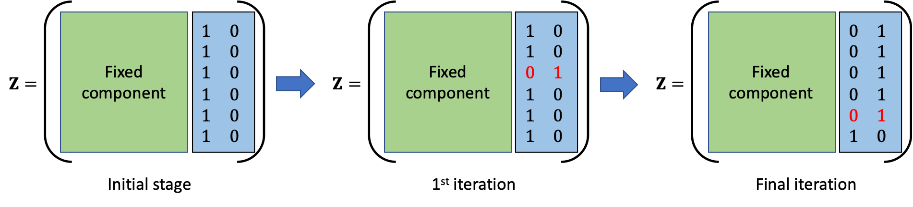
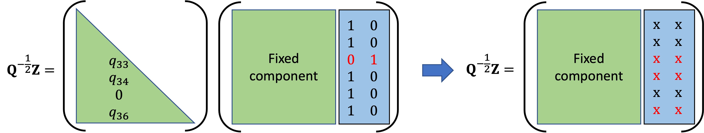

# Joss_RFGLS

# Package Features
* **Implementation**: The source code of the package are written in [C](https://en.cppreference.com/w/c/language)/[C++](https://isocpp.org/) for sake of optimizing execution time. The functions available to the user are wrappers around the source code, built with `R`'s foreign language interface. For the basic structure of the code, we make use of the open-source code of the regression trees in `R` based implementation of classical RF in `randomForest` package. As the split criterion in RF-GLS involves computationally intensive linear algebra operation in nested loops, we use `Fortran`'s Basic Linear Algebra Subprograms ([BLAS](http://www.netlib.org/blas/)) and Linear Algebra Package ([LAPACK](http://www.netlib.org/lapack/)). This is achieved by storing all matrices in contiguous memory column-major format. We also offer multicore computation by building each regression tree independently.

* **NNGP approximation**: Node splitting in RF-GLS requires optimizing a cost function involving the Cholesky factor of the precision matrix. Use of the full dense precision matrix in spatial processes becomes taxing on typical personal computing resources both in terms of computational cost ($O(n^3)$) and storage cost ($O(n^2)$). In order to circumvent this problem, we use NNGP to replace the dense graph among spatial locations with a nearest neighbor graphical model. NNGP components can be combined to obtain a sparse cholesky factor, which closely approximates the decorrelation performance of the true cholesky. We implement a convenient nearest neighbor search following [spNNGP](https://CRAN.R-project.org/package=spNNGP) [@spnngppaper] and efficient sparse matrix multiplication as in [BRISC](https://CRAN.R-project.org/package=BRISC) [@brisc]. The structure of the loops used in the process facilitates parallelization using `openMP` [@dagum1998openmp] for this stage of calculation. In time series analysis, the sparsity in the precision matrix is inherently induced by AR covariance structure. 

* **Scalable node splitting**: Another aspect of optimization of the proposed algorithm involves clever implementation of the cost function optimization. Provided candidate cut direction ($d$), the optimal cutoff point ($c$) is chosen by searching through the "gaps" in the corresponding covariate. Following the implementation of classical Regression Forest in [randomForest](https://CRAN.R-project.org/package=randomForest), we start with a list of ordered covariate values corresponding to the prefixed candidate direction and assign them to one of the nodes initially. This helps with searching through the "gaps" in the data, as searching the next "gap" is equivalent to switch of membership of the existing smallest member (w.r.t the covariate value in the prefixed direction) of the initially assigned node. In order to determine the cost function corresponding to each of the potential cutoff points, in each iteration, we serially switch the membership of the data points from the initial node. The process is graphically demonstrated in \autoref{fig:example}.

Since a serial update only affects one row in two columns of $\mathbf Z$ (corresponding to the newly formed nodes, an example of changes in $\mathbf Z$ corresponding to the changes in \autoref{fig:example} is demonstrated in \autoref{fig:example2}, here we note that the matrix components are unordered, hence the serial update will not follow the index ordering), the resulting correlation adjusted effective design matrix ($\mathbf Q ^{1/2} \mathbf Z$) only experiences changes in the corresponding two columns and the rows corresonding to the points, which have this specific point in their nearest neighbor set. We efficiently implement this in the package which provides efficiency over brute force recomputation of the effective design matrix for each serial update. The process is graphically demonstrated in \autoref{fig:example3}.

